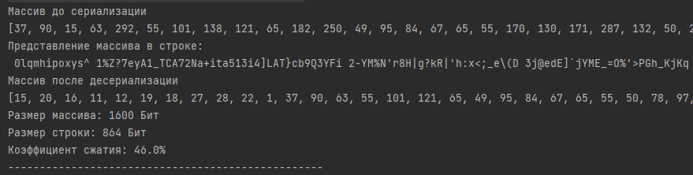

**Задание:**

Есть множество (массив, где порядок не важен) целых чисел в диапазоне от 1 до 300.
Количество чисел - до 1000.  

Напишите функцию сериализации / десериализации в строку, чтобы итоговая строка была компактной.  

Цель задачи - максимально сжать данные относительно простой сериализации без алгоритма сжатия (хотя бы 50% в среднем).  

Сериализованная строка должна содержать только ASCII символы. Можно использовать любой язык программирования.

Вместе с решением нужно прислать набор тестов: 
исходная строка, сжатая строка, коэффициент сжатия.

Примеры тестов: 
- простейшие короткие
- случайные - 50 чисел
- 100 чисел
- 500 чисел
- 1000 чисел 
- граничные - все числа 1 знака, все числа из 2х знаков, все числа из 3х знаков, каждого числа по 3 - всего чисел 900.

Ход мыслей:
1. Порядок чисел не важен - это плюс
2. Нужно представить каждое число таким образом, чтобы оно попадало в диапазон 33-126. Так как именно эти числа в 
кодировке ASCII печатаются.
3. Каждое число нужно "прокрутить" по рулетке. И количество оборотов нужно как-то запомнить.
Если число 180 попалось, значит нужно отнять 94, получим 86. В итоге один оборот.  
Число 94 получилось как разница = 127-33  
127 - использовать не можем, непечатный символ  
32 - использовать не можем
4. Числа в диапазоне 1-32 нужно каким то образом увеличить, чтобы они попали в рабочий диапазон
5. Числа, что уже находятся в нужном диапазоне преобразовать как есть, остальные нужно пометить
так, чтобы было понятно, сколько "оборотов" прошло число. 

Решение:
Создать Map<Byte, List<Short>>
Где Byte - указатель числа оборотов
List<Short> - список измененных чисел после "прокрутки". 

Указатель нам будет помогать с десереализацией, чтобы понимать как вернуть прежнее число.

Пример:

Массив до сериализации:  
[247, 165, 47, 206, 266, 192, 251, 61, 125, 229]  
Представление массива в строке:  
**1/=} 2Hqc 3=PA+**  
Массив после десериализации  
[47, 61, 125, 165, 206, 192, 247, 266, 251, 229]  
Размер массива: 160 Бит  
Размер строки: 128 Бит  
Коэффициент сжатия: 20.0%

Комментарии к тесту:  
Порядок после десереализации изменен, так как сначала производилась группировка по размерности чисел
и уже в конце формировалась строка по следующей схеме:  
"ЗНАК ПРОБЕЛА" + "Кол-во наращений цифры 94" + "Строка над каждым символом, которого нужно произвести операцию"

Знак пробела как разделитель на блоки, когда цикл встречает пробел - это означает, что следующая цифра сообщит, что делать
с дальнейшими строками

Коэффициент сжатия на малых массивах может быть очень низким, так как на разделители тратятся ресурсы.
Если чисел больше 50, то коэффициент примерно 49% сжатия, что и требуется по условию.

Входной массив имеет тип данных Short. Если входные данные будут представлены как Integer, 
то сжатие будет куда более существенным.

P.S.
1. Так как в условии было сказано, что числа в диапазоне 1-300, я захардкодил "корзины"  
Их всего 4.   
Если диапазон имеет шанс на расширение, то применил бы над Map технику мемоизации, для генерации 
новых корзин. 
2. Отказался бы от вложенного статического класса путем применения паттерна мост. Чтобы была возможность
менять алгоритмы сжатия подстановкой соответствующего класса.
